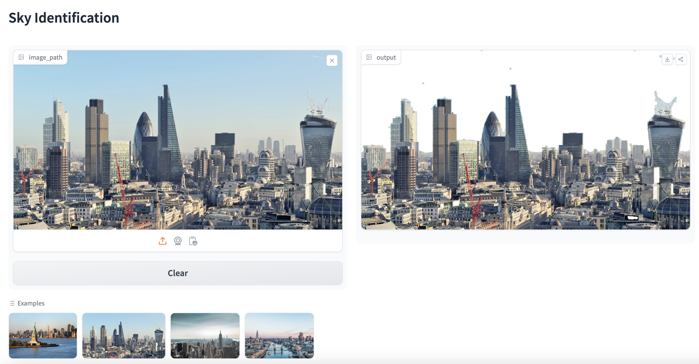

# Sky Pixel Identification using Image Processing
## Gradio Interface

You can interact with the Sky Pixel Identification interface using Gradio. Follow the link below to try it out with your own images:

[**Click here to Sky Pixel Identification Gradio Interface**](https://huggingface.co/spaces/FionaChen/Sky-Identification)

## Overview

This project aims to identify and emphasize sky pixels in an image using traditional computer vision techniques. The implementation utilizes OpenCV for image processing and Gradio for creating a user-friendly interface. The following documentation outlines the steps and results achieved in the process.

## Techniques
In this image project, I employ traditional computer vision techniques to highlight sky pixels. Beginning with grayscale conversion and adaptive thresholding, I then enhance local details and identify significant sky edges using Canny edge detection. Through dilation, inversion, and morphological operations, a refined mask is generated to distinguish potential sky regions. Post-processing ensures accuracy, leading to the extraction of sky pixels and their representation as white in a new image. Merging this modified sky image with the original produces a final output where the sky is emphasized. The implementation finally includes a Gradio interface for interactive exploration and visualization.

## Examples and Results

### Step 1: Original Image

### Step 2: Grayscale Conversion

### Step 3: Adaptive Thresholding

### Step 4: Canny Edge Detection

### Step 5: Dilation and Inversion

### Step 6: Mask Combination

### Step 7: Morphological Operations

### Step 8: Post-Processing

### Step 9: Sky Pixel Color Adjustment

### Step 10: Image Merging

## Gradio Interface

## Conclusion

In conclusion, this project provides a robust solution for identifying and emphasizing sky pixels in images. Users can interactively explore and visualize the effects of implemented techniques on their own images.

## Reflection
Initially, the project started by exploring the HSV color space for sky detection. However, the results observed were not consistently valid across different images, so a shift was made to grayscale processing.
Grayscale simplifies the image and enhances the prominence of edges, which is essential for accurate identification of sky pixels.
Adaptive thresholding and Canny edge detection proved to be effective in detecting and highlighting edges associated with the sky.
Morphological operations play a key role in refining masking, reducing noise, and separating sky and non-sky regions more clearly.
The project balances various techniques to robustly identify sky pixels, taking into account factors such as lighting conditions and image-specific features.